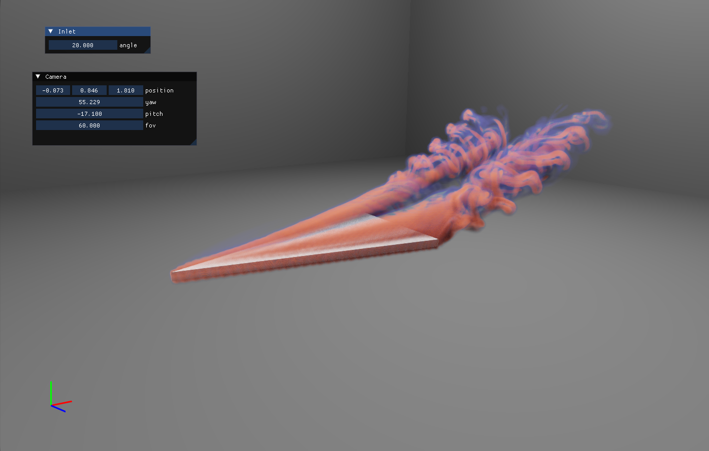

# Leapfrog Flow Maps for Real-Time Fluid Simulation
This repository contains a High-Performance LFM fluid simulation and a Poisson solver written in CUDA. 

Please consider citing Our paper if this repository helps you:

```
@article{sun2025lfm,
title={Leapfrog Flow Maps for Real-Time Fluid Simulation},
author={Sun, Yuchen and Li, Junlin and Wang, Ruicheng and Wang, Sinan and Li, Zhiqi and van Bloemen Waanders, Bart G. and Zhu, Bo},
journal={ACM Transactions on Graphics (TOG)},
volume={44},
number={4},
pages={1--12},
year={2025},
publisher={ACM New York, NY, USA}
}
```

The paper and video results can be found at the [Project Page](https://yuchen-sun-cg.github.io/projects/lfm/). 

## Build Instructions
We use xmake for cross-platform compilation. We successfully compiled the code on machines with Windows 11 / Ubuntu 22.04 and Nvidia RTX 4090. 

### 1. Clone the repository
```
git clone
```
### 2. Update submodule (for Vulkan Renderer)
```
git submodule update --init --recursive
```
### 3. Dependencies
* xmake
* C++ 20
* Cuda 12.6
* Vulkan
* sed, gnuutils (for Windows users)

### 4. Build

At proj/sim_render

```
xmake build
```


## Run

At proj/sim_render, run the executable file in proj/sim_render/build

You are expected to see:



## Configuration

In proj/sim_render/config